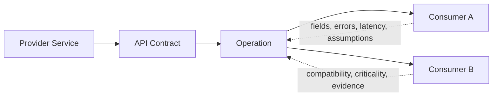

# API Accord

API Accord는 서비스 제공자와 소비자 사이의 **API 계약, 숨은 기대, 변경 합의, 구현 증거와 런타임 불일치**를 하나의 시간적 맥락으로 관리하는 API 중심 협업 시스템이다.

> API 문서를 보관하는 곳이 아니라, API를 둘러싼 합의가 왜 생겼고 누가 무엇에 의존하며 구현이 그 합의를 지켰는지를 증명하는 곳이다.

현재 저장소는 [이슈 #1](https://github.com/kuil09/api-accord/issues/1)과 [이슈 #2](https://github.com/kuil09/api-accord/issues/2)의 제품·개발 기준선을 제공한다. 실제 계약 카탈로그와 변경 워크플로 기능은 후속 이슈에서 구현한다.

## 해결하려는 문제

업스트림과 다운스트림 서비스는 같은 API를 사용하면서도 서로 다른 현실을 기억한다.

- 스펙에는 optional이지만 소비자는 항상 존재한다고 믿는 필드
- 제공자는 404라고 생각하지만 소비자는 200과 빈 배열을 기대하는 결과 없음 처리
- 문법상 additive지만 구버전 소비자를 깨뜨리는 enum 추가
- 담당자 교체와 시간 경과로 사라진 설계 이유
- PR은 머지됐지만 소비자 구현, 배포, 관찰은 끝나지 않은 변경

API Accord는 단순한 `서비스 → API` 그래프 대신 다음 관계를 관리한다.



계약은 노드에 있고, 실제 위험을 만드는 기대와 의존성은 엣지에 있다.

## 제품의 핵심 객체

- **Service**: API를 제공하거나 소비하는 실행 단위
- **API Contract / Operation**: 버전과 의미를 가진 계약 및 최소 협업 단위
- **Dependency Edge**: 소비자가 사용하는 필드, 오류, 지연, 부작용과 숨은 가정
- **Context Item**: 출처, 신뢰도, 유효 범위와 정정 계보를 가진 주장
- **Change Proposal**: 계약 변경 이유, diff, 영향, 승인과 이행 상태
- **Decision Record**: 토론에서 확정된 기계 판독 가능한 결정
- **Evidence**: 코드, 테스트, 배포, 관찰이 합의와 일치한다는 증거
- **Drift**: 계약, 구현, 소비자 기대 또는 런타임 사이의 불일치

상세 정의는 [도메인 용어집](docs/product/domain-glossary.md)을 따른다.

## GitHub와 비슷하지만 다른 점

| GitHub | API Accord |
|---|---|
| Repository | API Workspace |
| File | Operation, Schema, Policy |
| Issue | 질문, 불일치, 미정 사항 |
| Pull Request | Change Proposal |
| Review | 제공자·소비자 합의 |
| Merge | 계약 변경 승인 |
| Actions | 계약 검증·스펙 컴파일·증거 수집 |
| Dependency Graph | Operation별 소비 관계와 숨은 가정 |

코드 PR이 머지됐다고 API 변경이 완료된 것은 아니다. API Accord는 계약 승인, 제공자 구현, 소비자 준비, 계약 검증, 배포와 관찰을 독립 상태로 관리한다.

## API Accord가 아닌 것

- OpenAPI 렌더러만 제공하는 API 문서 사이트
- 자유 댓글을 쌓아두는 일반 포럼
- 회의 내용을 요약하는 AI 노트 도구
- 스키마 diff만으로 호환성을 단정하는 검사기
- 승인된 계약 없이 소스 코드를 직접 변경하는 자율 코딩 도구
- API Gateway 또는 서비스 메시의 대체재

## 저장소 구조

```text
apps/
  api/       HTTP API와 readiness 기준선
  web/       제품 셸과 정적 웹 서버
  worker/    PostgreSQL 기반 작업 큐 워커와 health server
packages/
  config/    환경 설정과 구조화 로깅
  contracts/ 프로세스 간 공용 계약 타입
  domain/    프레임워크 독립 도메인 유틸리티
  mcp/       후속 MCP 구현의 경계 패키지
infra/       로컬 PostgreSQL 구성
migrations/  순방향·역방향 SQL migration
scripts/     bootstrap, migration, smoke, 개발 프로세스
 docs/
  product/   제품 헌법, 용어, MVP 범위
  adr/       아키텍처 결정 기록
```

디렉터리 책임과 AI 작업 규칙은 [AGENTS.md](AGENTS.md)에 명시한다.

## 빠른 시작

### 요구 사항

- Node.js 22 이상
- npm 10 이상
- Docker와 Docker Compose

### 설치 및 실행

```bash
npm install --no-audit --no-fund
npm run bootstrap
npm run dev
```

`bootstrap`은 다음을 수행한다.

1. `.env`가 없으면 `.env.example`에서 생성
2. PostgreSQL 컨테이너 시작 및 health 대기
3. migration 적용

기본 주소는 다음과 같다.

| 프로세스 | 주소 | Health | Readiness |
|---|---:|---|---|
| API | `http://localhost:3000` | `/health` | `/ready` |
| Web | `http://localhost:3001` | `/health` | `/ready` |
| Worker | `http://localhost:3002` | `/health` | `/ready` |

API의 `/health`는 프로세스 생존만 확인하고, `/ready`는 PostgreSQL 연결을 확인한다. Worker의 `/ready`는 워커 실행 상태와 PostgreSQL 큐 연결을 확인한다.

### 주요 명령

```bash
npm run check          # lint, typecheck, test, build, migration 정적 검증
npm run build          # 전체 TypeScript project reference 빌드
npm run test           # 단위 테스트
npm run db:migrate     # 미적용 migration 적용
npm run db:rollback    # 마지막 migration 하나 롤백
npm run smoke          # 빌드된 web/API/worker와 실제 큐 작업 검증
npm run dev:infra:down # 로컬 PostgreSQL 종료
npm run clean          # 생성물 제거
```

`npm run smoke`는 PostgreSQL이 실행되고 migration이 적용된 상태에서 사용한다.

## 개발 원칙

1. 계약 변경과 코드 변경을 같은 상태로 취급하지 않는다.
2. 중요한 상태를 조용히 덮어쓰지 않고 사건과 정정 이력으로 남긴다.
3. AI가 생성한 내용은 출처와 신뢰도를 잃지 않으며 자동으로 사실이나 결정이 되지 않는다.
4. 소비자별 실제 의존성과 의미론적 위험을 구조적 diff보다 우선한다.
5. 모든 중요한 행위는 principal, 시각, 이유와 correlation ID로 추적 가능해야 한다.
6. 테스트 미실행, 증거 부족, 정보 부족을 성공으로 표현하지 않는다.

전체 규칙은 [제품 불변 규칙](docs/product/invariants.md)을 따른다.

## 제품 문서

- [제품 비전과 경계](docs/product/vision.md)
- [도메인 용어집](docs/product/domain-glossary.md)
- [제품 불변 규칙](docs/product/invariants.md)
- [MVP 범위와 기준 시나리오](docs/product/mvp-scope.md)
- [ADR 목록](docs/adr/README.md)
- [기여 절차](CONTRIBUTING.md)

## 기준 시나리오

모든 핵심 기능은 `payment-service`가 `PaymentStatus.REVERSED`를 추가하는 사례로 검증한다.

- `merchant-console`: unknown enum을 처리하지 못함
- `settlement-worker`: switch default가 없어 실패 가능
- `mobile-app`: 구버전 호환 매핑 필요

이 변경은 스키마 관점에서는 additive지만 소비 관계 관점에서는 위험하다. 자세한 단계와 인수 기준은 [MVP 범위 문서](docs/product/mvp-scope.md#기준-시나리오-paymentstatusreversed)를 따른다.

## 보안

실제 키, 토큰, 사용자 데이터와 운영 payload를 저장소에 커밋하지 않는다. `.env`는 Git에서 제외되며 예제에는 개발 전용 값만 둔다. 자격증명, 조직 격리, 민감정보와 감사 정책은 후속 이슈에서 확장하되, 현재 코드도 로그에 연결 문자열이나 payload 원문을 출력하지 않는 것을 기본으로 한다.
