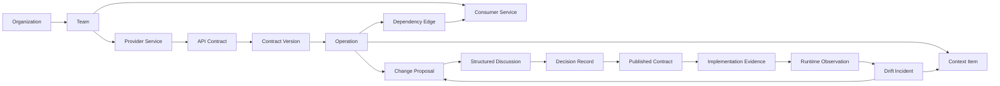
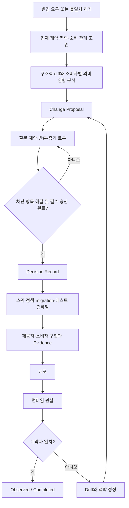

# API Accord 제품 비전과 경계

- 상태: Foundation baseline
- 관련 이슈: #1
- 최종 권위: 이 문서와 `invariants.md`, `domain-glossary.md`, `mvp-scope.md`의 합의된 내용

## 1. 문제 정의

서비스 간 API 협업의 실패는 스펙 파일이 없어서만 발생하지 않는다. 제공자와 소비자가 동일한 API를 서로 다른 의미로 기억하고, 그 기억의 근거와 적용 범위가 사라지는 것이 더 큰 문제다.

시간이 지나면 다음 정보가 분리되거나 유실된다.

- 어떤 사용자 문제 때문에 현재 형태를 선택했는가
- 제공자가 보장한다고 생각하는 동작은 무엇인가
- 소비자가 문서 밖에서 의존하는 동작은 무엇인가
- 구조상 안전해 보이는 변경이 어떤 소비자를 실제로 깨뜨리는가
- 누가 어떤 반론을 제기했고 어떤 제약 아래 결정했는가
- 코드가 합의를 구현했는지 무엇으로 증명했는가
- 배포된 동작이 스펙과 다를 때 무엇을 정정해야 하는가

기존 도구는 이 정보를 여러 장소에 나눈다.

- OpenAPI, AsyncAPI, Protobuf: 정적 계약 표현
- GitHub: 코드와 코드 변경
- 이슈·위키·메신저: 대화와 결정의 파편
- 테스트: 특정 시점의 검증
- Gateway·Tracing·APM: 런타임 관찰
- 서비스 카탈로그: 소유권과 단순 의존 관계

이 도구들이 각자의 역할을 수행해도 `왜 → 합의 → 계약 → 구현 → 증거 → 관찰 → 정정` 연결은 남지 않는다.

## 2. 제품 정의

> API Accord는 서비스와 소비자 사이의 API 계약, 숨은 기대, 변경 합의와 구현 증거를 시간적 의존성 그래프로 관리하고, 인간과 AI가 같은 권한·감사 규칙 위에서 설계·구현·검증하도록 하는 API 협업 운영체제다.

제품의 중심은 API 문서도 코드도 아니다.

**중심에는 합의된 계약과 그 계약에 의존하는 관계가 있다.**

## 3. 제품의 네 가지 약속

### 3.1 관계를 보존한다

`service-a → service-b` 수준의 연결로 끝내지 않는다. 소비자가 특정 Operation의 어떤 필드, enum, 오류, latency, retry, idempotency, 순서와 부작용에 의존하는지 기록한다.

### 3.2 맥락을 주장 단위로 보존한다

맥락을 AI 요약문이나 자유 문서 한 덩어리로 저장하지 않는다. 각 맥락은 작성자, 출처, 적용 범위, 신뢰도, 유효 기간과 정정 계보를 가진다.

### 3.3 합의와 이행을 분리해 추적한다

계약 승인, 제공자 구현, 소비자 준비, 테스트 검증, 배포와 런타임 관찰은 서로 다른 상태다. 하나가 끝났다고 나머지를 완료로 추정하지 않는다.

### 3.4 불일치를 새로운 입력으로 되돌린다

런타임이 스펙과 다르거나 소비자 가정이 틀렸다는 증거가 발견되면 기존 계약을 조용히 바꾸지 않는다. Drift, Context correction 또는 새 Change Proposal로 되돌린다.

## 4. 핵심 개념 모델

### 노드와 엣지

- 노드에는 계약, 결정, 버전과 증거가 존재한다.
- 엣지에는 소비자의 사용 방식, 숨은 가정, 중요도와 호환성 정책이 존재한다.
- 시간 축에는 생성, 확인, 정정, 대체, 승인, 이행, 관찰 사건이 존재한다.

이 세 요소 중 하나라도 없으면 변경 영향은 불완전하다.

## 5. GitHub와의 대응 관계

“API를 위한 GitHub”는 제품을 빠르게 설명하는 비유다. 다만 객체와 완료 의미가 다르다.

| GitHub | API Accord | 차이 |
|---|---|---|
| Repository | API Workspace | 코드 묶음이 아니라 계약과 관계 묶음 |
| File | Operation / Schema / Policy | 동작 의미와 소비자 기대 포함 |
| Commit | Contract snapshot / domain event | 변경 이유와 시간 상태 보존 |
| Issue | Question / Drift / unresolved context | API 범위와 영향 관계에 귀속 |
| Pull Request | Change Proposal | 여러 저장소와 배포를 포괄 |
| Review | Provider·Consumer agreement | 실제 영향 당사자를 관계 그래프로 계산 |
| Merge | Contract accepted/published | 구현이나 배포 완료를 뜻하지 않음 |
| Actions | Compile / contract test / evidence | 합의와 구현 일치 검증 |
| Dependency Graph | Operation dependency edge | 사용 필드와 숨은 가정까지 포함 |
| CODEOWNERS | API/Operation/Consumer ownership | 제공자와 각 소비자 승인 책임 분리 |

## 6. 주요 사용자와 Principal

### 인간 사용자

- API 제공 팀 개발자와 설계자
- 소비 서비스 개발자
- 제품·업무 정책 소유자
- 보안·데이터·플랫폼 검토자
- 장애 대응자와 운영 담당자

### 기계 Principal

- AI 에이전트
- CI 실행자
- 서비스 계정
- GitHub·Gateway·Tracing 통합
- 런타임 관찰기

각 principal은 독립된 신원, scope, 자격증명, 감사 기록을 가진다. 에이전트가 인간을 가장하거나 제안 권한을 승인 권한으로 확대할 수 없다.

## 7. 핵심 사용자 흐름

## 8. AI와 인간의 권한 경계

AI는 맥락 조립, 충돌 탐지, 초안 작성과 제한된 구현을 가속한다. 최종 사실과 조직적 책임을 대신하지 않는다.

| 행위 | AI 단독 가능 | 인간 또는 정책 승인 필요 |
|---|---:|---:|
| 스펙·코드·토론에서 관련 자료 수집 | 예 | 아니오 |
| 출처를 가진 Context 후보 생성 | 예 | 확정에는 필요 |
| 충돌·노후화·정보 부족 표시 | 예 | 판정 override에는 필요 |
| Change Proposal 초안 작성 | 예 | Accepted 전환에는 필요 |
| 구조적 diff 계산 | 예 | 규칙 override에는 필요 |
| 의미 영향 후보 산출 | 예 | 책임 있는 최종 판정에는 필요 |
| Decision Record 초안 작성 | 예 | 확정에는 필요 |
| 승인된 결정에서 스펙 컴파일 | 정책 허용 시 | 발행에는 정책에 따라 필요 |
| 구현 계획·패치 생성 | Accepted 이후 가능 | PR 승인·merge 필요 |
| 자동 배포 | MVP 불가 | 후속 정책과 명시 승인 필요 |
| 런타임 관찰에서 계약 자동 수정 | 불가 | 새 제안·정정 절차 필요 |

## 9. 제품 경계

### 제품이 직접 소유하는 것

- API·Operation·Contract Version의 협업 상태
- 소비 관계와 숨은 가정
- 출처와 신뢰도를 가진 Context ledger
- 구조화된 Discussion과 Decision Record
- Change Proposal, 승인과 이행 상태
- 스펙 컴파일과 호환성·영향 분석
- 구현·테스트·배포·관찰 Evidence 연결
- Drift와 맥락 정정 흐름
- Web·API·MCP에서 공유하는 권한·감사 규칙

### 외부 시스템에 위임하는 것

- 소스 코드 원본과 코드 리뷰: GitHub 등 Git provider
- 실행 트래픽 라우팅: API Gateway·service mesh
- 관측 데이터 수집 원본: tracing/APM/log platform
- 배포 실행: CI/CD platform
- 비밀정보 원본: secret manager
- 조직 사용자 원본: identity provider

API Accord는 이 시스템을 대체하지 않고, 해당 증거와 상태를 계약 맥락에 연결한다.

## 10. 명시적 비목표

- 범용 프로젝트 관리 도구
- 범용 소스 코드 호스팅
- API Gateway 구현
- 범용 채팅·메신저
- LLM 대화 기록 저장소
- 코드가 존재한다는 이유만으로 계약을 자동 확정하는 역공학 도구
- 인간 승인 없이 의미 변경을 배포하는 자율 시스템
- 모든 API 프로토콜을 MVP에서 동시에 지원

## 11. 성공의 의미

API Accord가 성공했다는 것은 문서 수가 늘었다는 뜻이 아니다. 다음 질문에 즉시 답할 수 있어야 한다.

1. 이 Operation은 왜 현재 형태인가
2. 누가 어떤 필드와 동작에 의존하는가
3. 이 변경은 소비자별로 왜 안전하거나 위험한가
4. 어떤 반론과 제약 아래 결정되었는가
5. 제공자와 소비자 구현이 준비됐다는 증거는 무엇인가
6. 어떤 계약 버전이 어떤 코드와 배포에 연결되는가
7. 런타임이 계약과 다를 때 무엇이 틀렸고 누가 교정해야 하는가
8. AI가 생성한 주장과 인간이 확인한 사실을 구분할 수 있는가
9. 과거 시점의 합의와 맥락을 재구성할 수 있는가
10. 마지막 소비자가 이행하기 전에 폐기 변경을 완료로 오인하지 않는가
